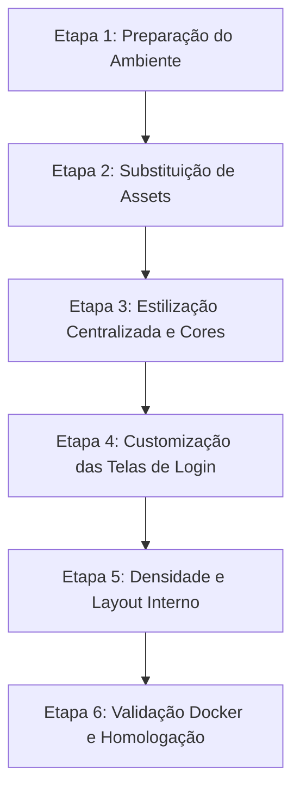

# Auditoria e Plano Técnico de Customização Visual — MOTHERXIP OS / Chatwoot

Este documento apresenta a auditoria técnica exaustiva do código-fonte do Chatwoot Community Edition e detalha o plano de customização visual inspirado no **MOTHERXIP OS / Alienxip CRM** (estética dark/cyber, paleta preta/roxa/slate, densidade operacional de dados e visual premium). O plano garante a integridade funcional do sistema, estabilidade do Docker e facilidade de atualização futura.

---

## 1. Estrutura Detalhada do Frontend Chatwoot

O Chatwoot possui uma arquitetura híbrida: um backend robusto em Ruby on Rails e um frontend single-page application (SPA) desenvolvido em **Vue.js (versão 3)**.

### Tecnologia do Frontend
- **Framework Core**: Vue 3 (utilizando Composition API com `<script setup>` nos componentes novos).
- **Gerenciamento de Estado**: Vuex (estado legado) e Pinia (estado novo) operando simultaneamente.
- **Compilador/Bundler**: Vite (configurado em [vite.config.ts](file:///c:/Users/israe/chatwoot-motherxip/chatwoot/vite.config.ts), [vite.shared.ts](file:///c:/Users/israe/chatwoot-motherxip/chatwoot/vite.shared.ts) e [vite.lib.config.ts](file:///c:/Users/israe/chatwoot-motherxip/chatwoot/vite.lib.config.ts)).
- **Estilização**: Tailwind CSS integrado a pré-processadores SCSS. A paleta é estruturada via variáveis CSS ligadas a classes Tailwind (e.g. `bg-n-background`).
- **Componentização**: A interface está em transição do diretório legado de componentes para a pasta `components-next` (identificada pelo alias `@/next`), que define o novo design system.

### Diretórios Estruturais
O código do frontend reside no diretório [app/javascript/](file:///c:/Users/israe/chatwoot-motherxip/chatwoot/app/javascript/):
- **[dashboard/](file:///c:/Users/israe/chatwoot-motherxip/chatwoot/app/javascript/dashboard/)**: Contém a aplicação do painel administrativo do atendente e administrador (App.vue, componentes, rotas, store e assets).
- **[shared/](file:///c:/Users/israe/chatwoot-motherxip/chatwoot/app/javascript/shared/)**: Código, stores, composables e componentes comuns compartilhados entre o painel e o widget de chat.
- **[v3/](file:///c:/Users/israe/chatwoot-motherxip/chatwoot/app/javascript/v3/)**: Contém a nova interface de login, registro, recuperação de senha e onboarding inicial.
- **[widget/](file:///c:/Users/israe/chatwoot-motherxip/chatwoot/app/javascript/widget/)**: Código correspondente ao widget de chat inserido em sites de terceiros.
- **[entrypoints/](file:///c:/Users/israe/chatwoot-motherxip/chatwoot/app/javascript/entrypoints/)**: Arquivos de bootstrap e montagem do Vue pelo Vite (e.g. `dashboard.js`, `v3app.js`, `widget.js`).

---

## 2. Mapeamento de Arquivos Principais

Identificamos os seguintes arquivos e componentes críticos para a customização visual e de marca:

### Layouts e Bootstrap
- **Layout Base Rails**: [vueapp.html.erb](file:///c:/Users/israe/chatwoot-motherxip/chatwoot/app/views/layouts/vueapp.html.erb) — Renderiza a tag de título da página, favicon, tags de manifesto, fontes do sistema e injeta a configuração global `window.globalConfig` no frontend.
- **Controller do Rails**: [dashboard_controller.rb](file:///c:/Users/israe/chatwoot-motherxip/chatwoot/app/controllers/dashboard_controller.rb) — Carrega as configurações de branding do banco/env e decide se o entrypoint deve ser `v3app` (para rotas de login/auth) ou `dashboard` (para o painel administrativo).
- **Layout de Rotas (Dashboard Vue)**: [Dashboard.vue](file:///c:/Users/israe/chatwoot-motherxip/chatwoot/app/javascript/dashboard/routes/dashboard/Dashboard.vue) — Layout principal do painel Vue. Renderiza a barra de navegação lateral (`NextSidebar`) e o painel de visualização (`router-view`).
- **Componente Root (Dashboard Vue)**: [App.vue](file:///c:/Users/israe/chatwoot-motherxip/chatwoot/app/javascript/dashboard/App.vue) — Componente raiz do painel administrativo, responsável por iniciar o tema de cores (`setColorTheme`), registrar escutas de preferências do sistema e importar o arquivo SCSS principal.

### Temas e Arquivos de Estilos
- **Arquivo CSS Central de Cores**: [_next-colors.scss](file:///c:/Users/israe/chatwoot-motherxip/chatwoot/app/javascript/dashboard/assets/scss/_next-colors.scss) — Define todas as variáveis CSS semânticas (como `--background-color`, `--surface-1`, `--surface-2`, `--border-weak`, `--border-strong`) e paletas do Radix UI (slate, iris, violet, blue, amber, ruby, teal) nos contextos `:root` (tema claro) e `.dark` (tema escuro).
- **Mapeamento Tailwind**: [colors.js](file:///c:/Users/israe/chatwoot-motherxip/chatwoot/theme/colors.js) — Exporta o objeto de mapeamento de cores que associa as variáveis CSS aos utilitários do Tailwind (usado em [tailwind.config.js](file:///c:/Users/israe/chatwoot-motherxip/chatwoot/tailwind.config.js)).
- **Estilos Globais**: [_woot.scss](file:///c:/Users/israe/chatwoot-motherxip/chatwoot/app/javascript/dashboard/assets/scss/_woot.scss) — Importa o Tailwind CSS, carrega as fontes Inter e InterDisplay, e define classes utilitárias tipográficas (como `.text-body-main`, `.text-heading-1`, `.text-button`).

### Componentes de Interface (Design System)
Os componentes visuais de controle estão em `app/javascript/dashboard/components-next/`:
- **Botões**: [Button.vue](file:///c:/Users/israe/chatwoot-motherxip/chatwoot/app/javascript/dashboard/components-next/button/Button.vue)
- **Inputs**: [Input.vue](file:///c:/Users/israe/chatwoot-motherxip/chatwoot/app/javascript/dashboard/components-next/input/Input.vue)
- **Badges/Labels**: [Label.vue](file:///c:/Users/israe/chatwoot-motherxip/chatwoot/app/javascript/dashboard/components-next/label/Label.vue)
- **Sidebar**: [Sidebar.vue](file:///c:/Users/israe/chatwoot-motherxip/chatwoot/app/javascript/dashboard/components-next/sidebar/Sidebar.vue) — Controla a navegação lateral, atalhos, alternador de contas e seções colapsáveis.
- **Alternador de Contas**: [SidebarAccountSwitcher.vue](file:///c:/Users/israe/chatwoot-motherxip/chatwoot/app/javascript/dashboard/components-next/sidebar/SidebarAccountSwitcher.vue)
- **Menu do Usuário**: [SidebarProfileMenu.vue](file:///c:/Users/israe/chatwoot-motherxip/chatwoot/app/javascript/dashboard/components-next/sidebar/SidebarProfileMenu.vue) — Exibe o perfil do atendente, status de disponibilidade e links de configurações e ajuda.

### Autenticação e Login
- **Tela de Login**: [Index.vue](file:///c:/Users/israe/chatwoot-motherxip/chatwoot/app/javascript/v3/views/login/Index.vue) — Tela de login V3, responsável por renderizar campos de e-mail, senha, botões de login via SAML/Google e tratamento de erros de autenticação.
- **Inputs de Login**: [Input.vue](file:///c:/Users/israe/chatwoot-motherxip/chatwoot/app/javascript/v3/components/Form/Input.vue)

### Sistema de Tradução (i18n)
- **Traduções do Dashboard**: Organizadas em arquivos JSON setorizados no diretório [app/javascript/dashboard/i18n/locale/en/](file:///c:/Users/israe/chatwoot-motherxip/chatwoot/app/javascript/dashboard/i18n/locale/en/) (como `settings.json`, `general.json` e `login.json`) e expostas globalmente via `index.js`.
- **Traduções do Widget**: Centralizadas em [en.json](file:///c:/Users/israe/chatwoot-motherxip/chatwoot/app/javascript/widget/i18n/locale/en.json).
- **Traduções do Rails**: Localizadas no arquivo YAML [config/locales/en.yml](file:///c:/Users/israe/chatwoot-motherxip/chatwoot/config/locales/en.yml).

---

## 3. Mapeamento de Pontos de Branding e White-Label

O Chatwoot possui suporte nativo para customização básica de marca (White-Labeling). O mapeamento dos pontos de alteração da marca original inclui:

1. **Ativação Automática de Instância Branded**:
   - O getter `isACustomBrandedInstance` definido em [globalConfig.js](file:///c:/Users/israe/chatwoot-motherxip/chatwoot/app/javascript/shared/store/globalConfig.js#L59) retorna `true` sempre que o parâmetro `installationName` for diferente de `'Chatwoot'`.
   - Se ativo, o componente `CustomBrandPolicyWrapper` e outros fluxos de política (e.g. `usePolicy.js`) ocultam automaticamente links de documentação, changelog e botão de chat de suporte do Chatwoot no painel principal e no menu lateral do usuário.
2. **Substituição de Imagens (Logotipos)**:
   - Os arquivos de logotipos oficiais que o servidor Rails serve estão em `/public/brand-assets/`:
     - `logo.svg`: Logotipo principal exibido em fundos claros (Login/Registro).
     - `logo_dark.svg`: Logotipo exibido em fundos escuros.
     - `logo_thumbnail.svg`: Ícone quadrado exibido na barra lateral ou telas menores.
   - Fallbacks SVG inline: O componente [Logo.vue](file:///c:/Users/israe/chatwoot-motherxip/chatwoot/app/javascript/dashboard/components-next/icon/Logo.vue) contém o SVG original do Chatwoot codificado diretamente. Substituí-lo garante a exibição do ícone da MOTHERXIP OS quando não houver logo customizado configurado no banco.
3. **Favicons e Manifesto**:
   - Os ícones de abas do navegador estão em `/public/` sob os nomes `/favicon-16x16.png`, `/favicon-32x32.png`, `/favicon-96x96.png`, `/favicon-badge-16x16.png` e `/favicon-badge-32x32.png`.
   - A configuração de manifesto `/public/manifest.json` controla o nome e cores de exibição do Chatwoot como PWA.
4. **Variações no Nome e Links de Direitos Autorais**:
   - O componente [Branding.vue](file:///c:/Users/israe/chatwoot-motherxip/chatwoot/app/javascript/shared/components/Branding.vue) lida com a exibição do texto *"Powered by Chatwoot"* no widget do chat. O comportamento responde a chaves como `BRAND_NAME` e `WIDGET_BRAND_URL` configuradas no backend.

---

## 4. Customizações Visuais Recomendadas (Identidade MOTHERXIP OS)

Para adequar o visual do Chatwoot ao design system operacional e dark do MOTHERXIP OS, propomos as seguintes adequações estéticas sem impacto na lógica:

### A. Paleta de Cores Dark-Cyber (Estilo Enforced)
Ajustar diretamente as variáveis CSS em [_next-colors.scss](file:///c:/Users/israe/chatwoot-motherxip/chatwoot/app/javascript/dashboard/assets/scss/_next-colors.scss) para sobrescrever os valores cromáticos em ambos os temas (:root e .dark) ou criar uma folha de overrides específica.
- **Fundo Principal (`--background-color`)**: Cinza cyber ultra escuro ou preto absoluto (e.g. `0 0 0` ou `10 10 12`).
- **Superfícies e Cards (`--surface-1`, `--surface-2`, `--card-color`)**: Tons de Slate/Neutral opacos e densos (e.g. `15 15 18` / `#0f0f12`), criando um layout coeso.
- **Cor Primária (`--brand`, `--blue-9`, `--iris-9`)**: Substituir o azul padrão por um roxo neon elétrico e contrastante (e.g. `rgb(147, 51, 234)` ou `#9333ea`).
- **Bordas (`--border-weak`, `--border-strong`)**: Mapear para cinzas operacionais de baixa visibilidade (e.g. `30 30 35` ou `#1e1e23`), mantendo a estética técnica com linhas finas de 1px.

### B. Densidade da Interface e Layout de Cards
- **Cards Densos**: Ajustar paddings e margens em [ChatList.vue](file:///c:/Users/israe/chatwoot-motherxip/chatwoot/app/javascript/dashboard/components/ChatList.vue) e no componente de item de conversa [ConversationItem.vue](file:///c:/Users/israe/chatwoot-motherxip/chatwoot/app/javascript/dashboard/components/ConversationItem.vue) para aumentar a volumetria de informações visíveis simultaneamente.
- **Cantos Retos/Operacionais**: Modificar os componentes de controle (e.g. [Button.vue](file:///c:/Users/israe/chatwoot-motherxip/chatwoot/app/javascript/dashboard/components-next/button/Button.vue) e [Input.vue](file:///c:/Users/israe/chatwoot-motherxip/chatwoot/app/javascript/dashboard/components-next/input/Input.vue)) para reduzir cantos excessivamente arredondados (substituir classes `rounded-lg` ou `rounded-xl` por `rounded-sm` ou `rounded` leves).

### C. Sidebar com Estilo do MOTHERXIP OS
- Aplicar o fundo escuro (`bg-n-background`) e borda divisória sutil (`border-n-weak`).
- Implementar hover de roxo neon elétrico suave nos itens ativos e nos ícones da barra lateral.

### D. Experiência de Login Premium
- Atualizar a tela de login V3 ([Index.vue](file:///c:/Users/israe/chatwoot-motherxip/chatwoot/app/javascript/v3/views/login/Index.vue)) substituindo o fundo original por um gradiente de preto absoluto com brilho violeta radial desfocado no centro (estilo dark premium).
- Customizar os botões e inputs de login para incluir bordas finas com foco em roxo elétrico.

---

## 5. Riscos e Impactos Técnicos

1. **Dificuldade em Atualizações Oficiais (Rebase/Merge Conflicts)**: Modificar a marca diretamente no código HTML de componentes lógicos pode gerar conflitos complexos ao mesclar versões futuras do repositório upstream.
   - *Atenuação*: Concentrar 95% das mudanças visuais em arquivos CSS/SCSS isolados e substituição de assets estáticos na pasta `public/`.
2. **Erros de Acessibilidade e Contraste**: Ao alterar a paleta de cores globais, alguns textos informativos ou badges cinzas podem perder contraste e ficar ilegíveis contra fundos escuros.
   - *Atenuação*: Validar o contraste das variáveis de texto (e.g. `--slate-11`, `--slate-12`) no novo tema.
3. **Impacto no Cache de Compilação**: Arquivos CSS processados e compilados pelo Vite podem apresentar comportamentos inconsistentes em ambientes Docker devido ao cache de compilação de assets.
   - *Atenuação*: Sempre limpar os volumes do Docker e forçar a recompilação ao alterar estilos.

---

## 6. Plano de Implementação em Etapas



### Etapa 1 — Preparação do Ambiente
- Criar a branch de trabalho isolada: `motherxip-theme`.
- Executar o setup de dependências locais (`bundle install` e `pnpm install`) e certificar-se de que a suíte de testes original está operacional.

### Etapa 2 — Substituição de Assets Estáticos
- Substituir arquivos de imagem (logotipos e favicons) no diretório `public/brand-assets/` e no diretório raiz do `public/` pelos arquivos equivalentes do MOTHERXIP OS.
- Substituir o código SVG de fallback inline no componente de ícone [Logo.vue](file:///c:/Users/israe/chatwoot-motherxip/chatwoot/app/javascript/dashboard/components-next/icon/Logo.vue).

### Etapa 3 — Estilização Centralizada e Cores
- Inserir a nova paleta roxa/preta/slate nas declarações de `:root` e `.dark` no arquivo [_next-colors.scss](file:///c:/Users/israe/chatwoot-motherxip/chatwoot/app/javascript/dashboard/assets/scss/_next-colors.scss).
- Configurar variáveis de ambiente de branding (`INSTALLATION_NAME=MOTHERXIP OS`, `BRAND_NAME=MOTHERXIP`) no arquivo `.env` para disparar a política nativa de ocultação de marcas externas (White-Labeling) via `CustomBrandPolicyWrapper`.

### Etapa 4 — Customização das Telas de Login
- Estilizar a tela de autenticação V3 ([Index.vue](file:///c:/Users/israe/chatwoot-motherxip/chatwoot/app/javascript/v3/views/login/Index.vue)) aplicando a temática premium roxo/escura.

### Etapa 5 — Densidade e Layout Interno
- Reduzir espaçamentos e paddings na área de listagem e visualização de conversas, e ajustar o formato das bordas e cantos arredondados de componentes comuns (`button/Button.vue` e `input/Input.vue`).

### Etapa 6 — Validação Docker e Homologação
- Executar os linters estilísticos (`pnpm eslint` e `bundle exec rubocop`) para validar a conformidade das edições.
- Subir a aplicação em ambiente Docker, gerando a compilação final em produção e testando a renderização visual do dashboard e widget de chat.

---

## 7. Estratégia de Atualização do Chatwoot

Para garantir que a branch `motherxip-theme` permaneça fácil de ser atualizada a partir do repositório oficial do Chatwoot:

1. **Centralização Estética**: Não mexer nos fluxos de controle lógico de componentes. Manter as modificações visuais isoladas nos arquivos de tema (CSS/SCSS) e arquivos estáticos públicos.
2. **Abordagem Configurável**: Sempre que possível, configurar marcas e dados básicos (e.g. nomes da instalação e links de suporte) via variáveis de ambiente no arquivo `.env` ou inserindo registros no banco de dados através da tabela `InstallationConfig` utilizando o console Rails do Super Admin.
3. **Processo de Atualização (Upstream Sync)**:
   - Manter a branch `main` original apontada para o repositório oficial.
   - Sincronizar atualizações na branch `main`.
   - Executar `git checkout motherxip-theme && git rebase main` para reaplicar o tema sobre a versão oficial atualizada. Como as modificações visuais estarão contidas em arquivos isolados, a incidência de conflitos de merge será mínima.

---

## 8. Plano Técnico de Integração Futura com MOTHERXIP OS

O ecossistema principal do MOTHERXIP OS e a instância customizada do Chatwoot poderão ser acoplados através das seguintes abordagens técnicas analisadas:

### Opção A: Domínio Dedicado / Subdomínio (Recomendado)
- **Como funciona**: O Chatwoot roda sob o subdomínio `atendimento.motherxip.com`.
- **Análise**: Essa opção é a mais simples e segura. Evita conflitos de cookies, problemas de bloqueio de navegadores a iframes de terceiros (cross-origin) e simplifica o deploy.

### Opção B: Embarcado via Iframe Seguro no CRM
- **Como funciona**: A aplicação do MOTHERXIP OS renderiza o painel do Chatwoot dentro de um componente de `<iframe>`.
- **Segurança**: É necessário alterar as configurações de CSP (Content Security Policy) e cabeçalhos `X-Frame-Options` no backend Rails do Chatwoot para permitir o domínio pai (e.g., `frame-ancestors 'self' https://*.motherxip.com`).
- **Ocultação de Sidebar Dupla**: Para evitar o layout visualmente incorreto de duas barras laterais simultâneas (a do CRM e a do Chatwoot), podemos passar uma query string na URL do iframe (e.g. `?embed=true`). No frontend do Chatwoot, detectamos a query e aplicamos uma classe CSS condicional para ocultar a sidebar principal.

### Opção C: Integração via APIs REST e Webhooks
Permite criar uma interface de chat 100% nativa ou sincronizar dados em tempo real no banco do CRM principal.
- **Webhooks**: Configurar o Chatwoot para notificar o MOTHERXIP OS a cada mensagem criada, conversa alterada ou contato cadastrado.
- **API REST**: Consumir os endpoints oficiais de contatos (`POST /api/v1/accounts/{id}/contacts`), conversas (`GET/POST /api/v1/accounts/{id}/conversations`) e mensagens do Chatwoot para sincronizar contatos e históricos.
- **Vinculação de Entidades**: Criar no banco de dados do MOTHERXIP OS a correlação entre `crm_prospect_id` ou `crm_client_id` e o `chatwoot_contact_id`.

### Opção D: SSO (Single Sign-On) e Autenticação Unificada
- **Como funciona**: O agente loga no MOTHERXIP OS e é automaticamente autenticado no Chatwoot (inclusive se embutido via iframe).
- **Implementação**: Configurar o SAML SSO ou utilizar a geração de tokens de acesso JWT no backend Rails. Ao renderizar o iframe do Chatwoot, o CRM assina um token JWT contendo o e-mail do agente logado e envia como parâmetro na URL para autenticar a sessão do atendente instantaneamente.

### Opção E: Dashboard Apps (Iframe Contextual no Chatwoot)
- **Como funciona**: Renderiza dados do CRM na barra lateral direita do Chatwoot.
- **Implementação**: Criar um "Dashboard App" nas configurações do Chatwoot que aponta para um endpoint específico do CRM (e.g. `https://motherxip.com/integrations/chatwoot?contact_id={{contact.custom_attributes.motherxip_contact_id}}`). Isso permite que os atendentes acessem em tempo real a ficha de prospect e histórico financeiro do cliente do CRM diretamente na tela de conversa do Chatwoot.

---

## 9. Comandos e Validação do Ambiente

Para homologar a instância localmente e realizar os testes do tema visual, execute a seguinte rotina de comandos:

```bash
# 1. Instalação de dependências de backend Ruby e frontend JS
bundle install && pnpm install

# 2. Inicialização do servidor de desenvolvimento (Rails + Vite Dev Server)
pnpm dev
# OU utilizando o gerenciador de processos Overmind:
overmind start -f ./Procfile.dev

# 3. Seed de dados mínimos para homologação de telas
bundle exec rails db:seed

# 4. Execução de linters para validar integridade sintática e estilo de código
pnpm eslint          # Eslint para componentes Vue/JS
bundle exec rubocop  # Rubocop com auto-correção segura para Ruby

# 5. Execução de testes de regressão
pnpm test            # Testes frontend
bundle exec rspec    # Testes backend
```
